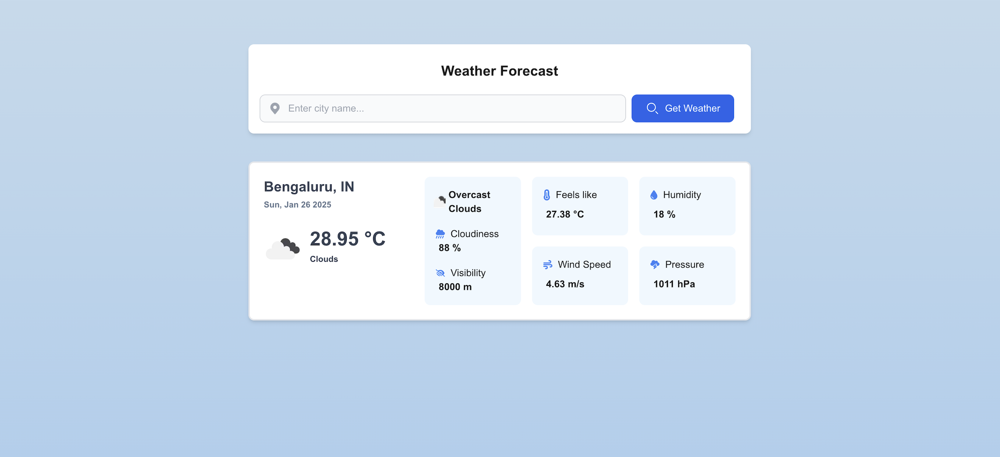
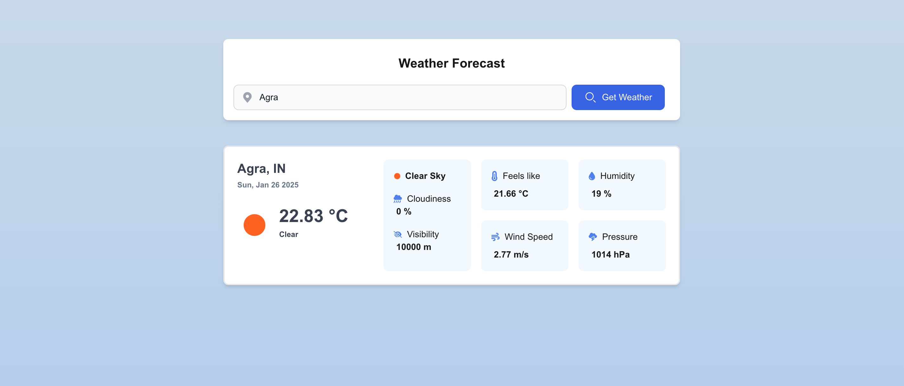
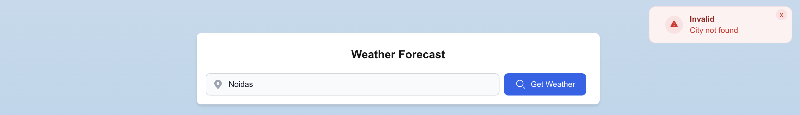
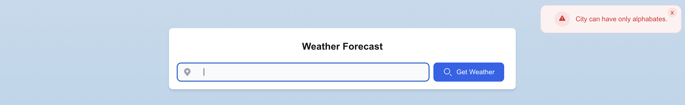

A fullstack weather application shows **real time current weather of a city asthetically** using Open Weather API.

Displays current weather conditions and its **desciption** along with **temperature, percieved temperature, humidity, cloudliness, visibility, windspeed** and **atmospheric pressure** in matric scale (i.e. metric units)

#### Setting up on local system

##### web_app (Frontend)

1. fork the repo and change directory to `web_app`
2. create `.env` file if not exist and add the below variable mentioning  the backend service url

   `NEXT_PUBLIC_BACKEND_API_URL=http://localhost:3300`
3. run  ` npm install`   (with node 20 or above)
4. run  `npm run dev`

##### server(backend)

1. fork the repo and change directory to `server`
2. create `.env` file if not exist and add the below variable mentioning  environment varibles. Replace `your_open_weather_apikey` with your actual open weather api from dashboard after logging in ([open weather api keys](https://home.openweathermap.org/api_keys))

```
OPEN_WEATHER_API_KEY="your_open_weather_apikey"
OPEN_WEATHER_API_URL="https://api.openweathermap.org"
WEATHER_ICON_URL="https://openweathermap.org/img/wn/"
ALLOWED_ORIGIN="http://localhost:3000"
PORT=3300
```
   Generate weather api key if for the first time user. Sign up and generate the key [openweathermap user sign up](https://home.openweathermap.org/users/sign_up)

4. run  `npm install`   (with node 20 or above)
5. run  `npm start` (Service will start at `http://localhost:3300`)

## Features & Tech stack

##### web_app (Frontend)

* **Next.js page** routing framework used, **Tailwind** for css
* **Geolocation webap**i  used to show weather of user current location
* Has discreate folder structure for better scalablity and understanding
* Proper validations and error handling
* Custom reusable components, utility fucntions and hooks
* **404 file** to grep unrecognised invalid routes and redirect to home route.

  **Tech used:** Next.js, Typescript, Axios, TailwindCss

##### server (Backend)

* Discreate folder structure for routes
* environment variables
* Middlewares for error handling

  **Tech used:** Express.js, Node.js, Axios, dotenv

## Snapshots

| Current city weather                           | Entered city weather                           |
| ---------------------------------------------- | ---------------------------------------------- |
|  |  |

| Various error handling                                                                                                                                 |
| ------------------------------------------------------------------------------------------------------------------------------------------------------ |
| <br /><br /> |

## Way forward

* **Web_app**:

  Added **Autosuggestion based on city input**
  
  Impementing Hourly, Weekly weather forcast
  
  Adding middleware, errorboundary, state management tools like redux, reducer or context api, zustand
  
  Dark mode
  
  Animation
* **Server**
  Autosuggestions based on city name api
  
  Hourly, Weekly weather forcast from one by one call weather api

Contact me at **s.himanshusingh56@gmail.com** for further discussion or contribution or anything issue faced in api generation or setting it up.
